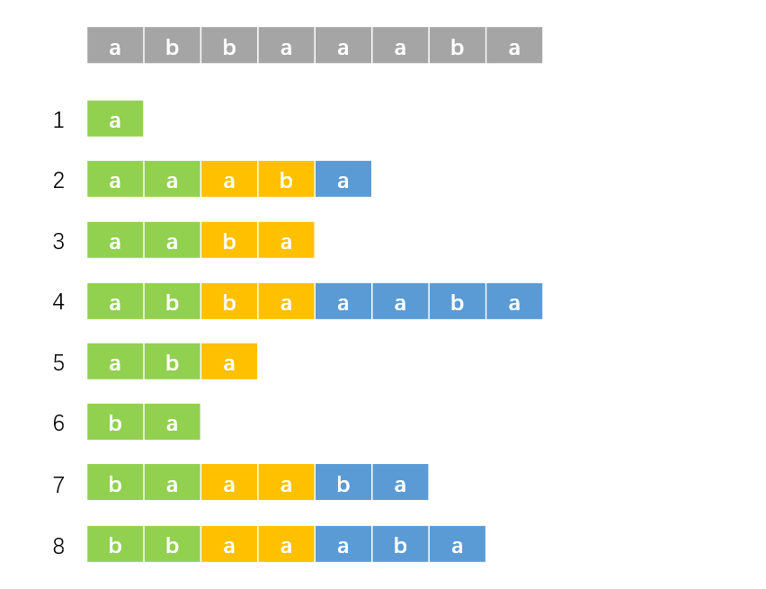
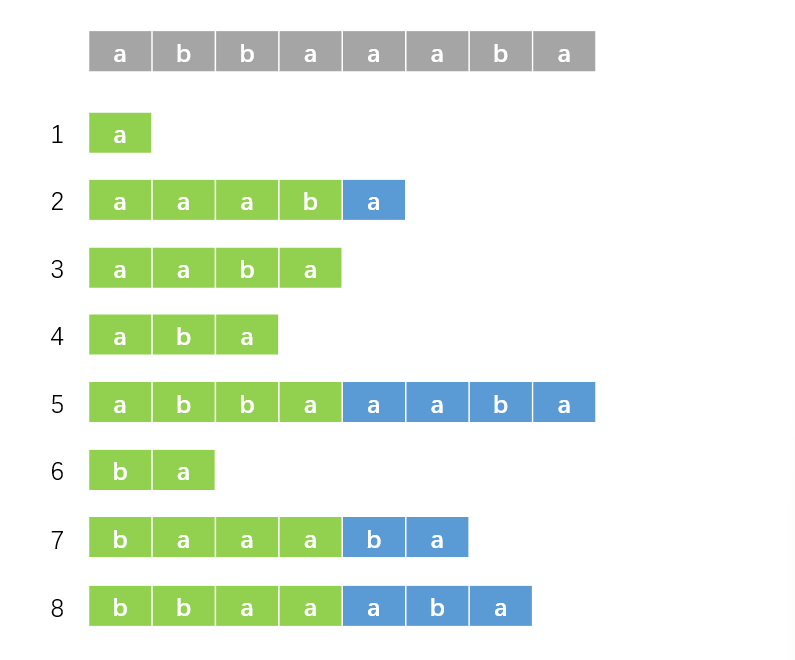

## 前言

后缀数组板子一遍过了，开心。

这篇学习笔记整体框架上与 OI-Wiki 相似，但保证本文章大部分原创。

前置知识：基数排序、倍增。

## 记号与约定

字符串即为 $s$。

记 "后缀 $i$" 表示从 $i$ 开始的后缀，即 $s[i\dots n]$，它代表后缀的编号。

记 $sa[i]$ 表示排名为 $i$ 的后缀的编号，$rk[i]$ 表示后缀 $i$ 的排名。显然有 $sa[rk[i]] = rk[sa[i]] = i$。

记 $\lvert T \rvert$ 表示字符串 $T$ 的长度。特别地，记 $n = \lvert s \rvert$。

如果以 $a[i]$ 表示一个数组，那么这意味着会出现与该数组有关的嵌套（比如 $sa[rk[i]]$）。如果以 $a_i$ 表示一个数组，那么意味着它的表示比较简单且不会出现嵌套。严格来说，不应该使用前者来表示一个数组，但为了方便读者阅读，本文使用了该方式，我尽量做到能用后者就用后者。

## 求法

### $O(n^2\log n)$ 做法

暴力对每个后缀进行排序，每次比较的复杂度为 $O(n)$，排序复杂度为 $O(n\log n)$，总复杂度 $O(n^2\log n)$。

### $O(n \log^2{n})$ 做法

对于字符串 $s$ 的所有后缀，它们有大量重复部分，而直接排序就会进行大量重复比较，不如换个角度入手。

我们先从一组数据入手。对于 $s = \texttt{abbaaaba}$，我们先以每个后缀第一个字符为第一关键字，第二个字符为第二关键字进行排序，其实也就是对于每个后缀的前两个字符进行排序，结果如下：


根据上面的定义，绿色部分的排名即为 $rk$ 数组。观察这些后缀，我们现在知道绿色部分的排名。而由后缀的性质，蓝色部分其实也是后缀，那么其实我们也知道下图中黄色部分的排名：



那么我们使用绿色部分的排名（即原排名，$rk$ 数组）为第一关键字，黄色部分的排名（即对于后缀 $i$，第一个图中的蓝色部分是后缀 $i + 2$，那么黄色部分的排名即为后缀 $i + 2$ 的原排名，即 $rk[i + 2]$）为第二关键字，进行排序，结果如下：



很好，现在绿色部分（已排序部分）的长度由 $2$ 变为了 $4$。我们接下来再选取长度为 $4$ 的黄色部分，这样，我们就成功对后缀的前 $8$ 个字符排序了。以此类推，我们每次都倍增排序长度，并且重复以上操作，那么我们就可以在 $O(n \log^2{n})$ 的复杂度内解决掉这个问题了（排序 $O(n\log n)$，倍增 $O(\log n)$）。

???+ note "形式化的解法"
    设需要排序长度为 $w$。
    
    对于后缀 $i$，我们知道按它的第 $1$ 个字符到第 $w/2$ 个字符排序的排名。对于后缀 $i + w/2$ 也是如此，这相当于我们知道按后缀 $i$ 的第 $w/2 + 1$ 个字符到第 $w$ 个字符排序的排名。那么我们以 $rk[i]$ 为第一关键字，$rk[i+w/2]$ 为第二关键字进行排序即可。

    倍增 $w$，即 $w \gets 2 \times w$。

### $O(n \log{n})$ 做法

字符串有一个特点：值域小。也就是说每个位置的取值种类少。这样，我们就可以利用基数排序的思想。

具体地，先按第一个关键字扔进桶里，再按从大到小按第二关键字遍历桶即可。代码中的第二关键字进行了离散化，它代表第二关键字的排名。代码如下：

```cpp
void f_sort() {
    for (int i = 1; i <= m; i++) b[i] = 0;
    for (int i = 1; i <= n; i++) b[rk[i]]++;
    for (int i = 1; i <= m; i++) b[i] += b[i - 1];
    for (int i = n; i >= 1; i--) sa[b[rk[tp[i]]]--] = tp[i];
}
```

可以看到，这样排序的复杂度是 $O(n)$。我们成功地将总复杂度优化为 $O(n\log n)$。

我们求出 $sa$ 数组了之后，不能直接用 $rk[sa[i]] = i$ 给 $rk$ 赋值，这是因为有可能有些后缀的第一二关键字都相同，那么它们的排名也相同，这需要特判一下。

容易观察到第二关键字是由第一关键字平移得到，那么我们就可以 $O(n)$ 求第二关键字。而且第二关键字我们只需要排名，可以进行一点小优化。具体实现见代码。

??? note "完整代码"
    ```cpp
    #include <bits/stdc++.h>
    using namespace std;

    const int N = 1e6 + 10;
    int n, m;
    int sa[N], rk[N];
    int b[N], tp[N];
    char c[N];

    void f_sort() {
        for (int i = 1; i <= m; i++) b[i] = 0;
        for (int i = 1; i <= n; i++) b[rk[i]]++;
        for (int i = 1; i <= m; i++) b[i] += b[i - 1];
        for (int i = n; i >= 1; i--) sa[b[rk[tp[i]]]--] = tp[i];
    }
    void g_sa() {
        for (int i = 1; i <= n; i++) rk[i] = c[i], tp[i] = i;
        f_sort();
        int p = 0;
        for (int w = 1; w <= n; w <<= 1) {
            if (p >= n) break;
            p = 0;
            for (int i = n - w + 1; i <= n; i++) tp[++p] = i;
            for (int i = 1; i <= n; i++) {
                if (sa[i] > w) tp[++p] = sa[i] - w;
            }
            f_sort(), swap(rk, tp), rk[sa[1]] = p = 1;
            for (int i = 2; i <= n; i++) {
                int sl = sa[i - 1], sr = sa[i]; 
                if (tp[sl] == tp[sr] && tp[sl + w] == tp[sr + w]) {
                    rk[sa[i]] = p;
                } else rk[sa[i]] = ++p;
            }
            m = p;
        }
    }

    int main() {
        scanf("%s", c + 1);
        n = strlen(c + 1), m = 127;
        g_sa();
        for (int i = 1; i <= n; i++) {
            printf("%d ", sa[i]);
        }
        return 0;
    }
    ```

### $O(n)$ 做法

一般用不到，但是可以开拓一下眼界。

常见的做法有 $\text{SA-IS}$ 算法和 $\text{DC3}$ 算法，请分别参考 [诱导排序与 SA-IS 算法](https://riteme.site/blog/2016-6-19/sais.html) 和 [国家集训队2009论文-后缀数组——处理字符串的有力工具-罗穗骞](https://github.com/OI-wiki/libs/blob/master/%E9%9B%86%E8%AE%AD%E9%98%9F%E5%8E%86%E5%B9%B4%E8%AE%BA%E6%96%87/%E5%9B%BD%E5%AE%B6%E9%9B%86%E8%AE%AD%E9%98%9F2009%E8%AE%BA%E6%96%87%E9%9B%86/11.%E7%BD%97%E7%A9%97%E9%AA%9E%E3%80%8A%E5%90%8E%E7%BC%80%E6%95%B0%E7%BB%84%E2%80%94%E2%80%94%E5%A4%84%E7%90%86%E5%AD%97%E7%AC%A6%E4%B8%B2%E7%9A%84%E6%9C%89%E5%8A%9B%E5%B7%A5%E5%85%B7%E3%80%8B/%E5%90%8E%E7%BC%80%E6%95%B0%E7%BB%84%E2%80%94%E2%80%94%E5%A4%84%E7%90%86%E5%AD%97%E7%AC%A6%E4%B8%B2%E7%9A%84%E6%9C%89%E5%8A%9B%E5%B7%A5%E5%85%B7.pdf)。

## $\text{Height}$ 数组

这部分主要讲解 $\text{Height}$ 数组，记为 $ht[i]$。

### 最长公共前缀

记 $\text{suf}(i)$ 表示后缀 $i$。

对于字符串 $S$ 和 $T$，定义其最长公共前缀 $\text{LCP}(S,T)$ 为最大的 $k(k \leq \min\{\lvert S \rvert,\lvert T \rvert\})$，使得对于任意 $i(1 \leq i \leq k)$，有 $S_i = T_i$。

记 $\text{lcp}(i, j)$ 为后缀 $sa[i]$ 与后缀 $sa[j]$ 的最长公共前缀的长度。

容易知道 $\text{lcp}(i, j) = \text{LCP}(\text{suf}(sa[i]),\text{suf}(sa[j]))$

#### $\text{LCP Lemma}$

对任意 $1 \leq i < j < k \leq n$，有

$$
\text{lcp}(i,k) = \min\{\text{lcp}(i,j),\text{lcp}(j,k)\}
$$

???+ note "证明"
    设 $p=\min\{\text{lcp}(i,j),\text{lcp}(j,k)\}$，则有 $\text{lcp}(i,j)\geq p,\text{lcp}(i,j)\geq p$。

    设 $\text{suf}(sa[i])=u,\text{suf}(sa[j])=v,\text{suf}(sa[k])=w$。

    所以 $u$ 和 $v$ 的前 $p$ 个字符相等，$v$ 和 $w$ 的前 $p$ 个字符相等。所以 $u$ 和 $w$ 的前 $p$ 个字符相等，即 $\text{lcp}(i,k)\geq p$，设其为 $q$，则 $q \geq p$。

    假设 $q > p$，即 $q \geq p + 1$，所以 $u$ 和 $w$ 的前 $p + 1$ 个字符相等。记上述性质为性质 X。
    
    又因为 $p=\min\{\text{lcp}(i,j),\text{lcp}(j,k)\}$，所以 $u[p+1]\neq v[p+1]$ 或 $v[p+1]\neq w[p+1]$，且 $u[p+1] \leq v[p+1] \leq w[p+1]$。

    但又由性质 X，$u[p+1]=w[p+1]$，即 $u[p+1] = v[p+1] = w[p+1]$，矛盾，故 $q \leq p$。

    综上所述，有 $q \geq p$，且 $q \leq p$，则 $q = p$，所以 $\text{lcp}(i,k) = p$，即 $\text{lcp}(i,k) = \min\{\text{lcp}(i,j),\text{lcp}(j,k)\}$。

    证毕。

#### $\text{LCP Theorem}$

设 $i < j$，有

$$
\text{lcp}(i, j) = \min_{i < k \leq j}\{\text{lcp}(k-1, k)\}
$$

???+ note "证明"
    令 $j=i+t$，原命题等价于

    $$
    \text{lcp}(i, i+t) = \min_{i < k \leq i+t}\{\text{lcp}(k-1, k)\}
    $$

    对 $t$ 使用数学归纳法，当 $t=1$ 或 $t=2$ 时显然成立。

    由 $\text{LCP Lemma}$，有

    $$
    \text{lcp}(i, i+t) = \min\{\text{lcp}(i, i+t-1),\text{lcp}(i+t-1,i+t)\}
    $$

    由归纳假设，有

    $$
    \text{lcp}(i, i+t-1) = \min_{i < k \leq i+t-1}\{\text{lcp}(k-1, k)\}
    $$

    即

    $$
    \text{lcp}(i, i+t) = \min\{\min_{i < k \leq i+t-1}\{\text{lcp}(k-1, k)\},\text{lcp}(i+t-1,i+t)\}
    $$

    即 

    $$
    \text{lcp}(i, i+t) = \min_{i < k \leq i+t}\{\text{lcp}(k-1, k)\}
    $$

    证毕。

#### $\text{LCP Corollary}$

对于 $i \leq j < k$，有

$$
\text{lcp}(j, k) \geq \text{lcp}(i, k)
$$

利用 $\text{LCP Theorem}$，证明显然。

### 基本定义

有定义

$$
ht[i] = \text{lcp}(i-1,i)
$$

其中 $ht[1] = 0$。

定义数组 $H[i]$，有 $H[i] = ht[rk[i]]$，则有 $ht[i] = H[sa[i]]$。

### 一个重要引理

有如下引理

$$
H[i] \geq H[i - 1] - 1
$$

???+ note "证明"
    若 $H[i] \leq 1$，引理显然成立，下面我们讨论 $H[i] > 1$ 的情况。

    首先，显然有 $\text{LCP}(\text{suf}(i+1),\text{suf}(j+1)) = \text{LCP}(\text{suf}(i),\text{suf}(j))-1$（有 $\text{LCP}(\text{suf}(i),\text{suf}(j)) \geq 1$），这相当于把两个后缀都往后移了一个字符，证明略。记上述性质为性质 X。

    记 $j=sa[rk[i-1]-1]$。显然有 $\text{suf}(j) < \text{suf}(i-1)$。
    
    根据 $H$ 数组的定义，有

    $$
    \begin{aligned}
    H[i-1] &= ht[rk[i-1]] \\
           &= \text{lcp}(rk[i-1]-1,rk[i-1]) \\
           &= \text{LCP}(\text{suf}(sa[rk[i-1]-1]),\text{suf}(sa[rk[i-1]])) \\
           &= \text{LCP}(\text{suf}(j),\text{suf}(i-1)) 
    \end{aligned}
    $$

    由性质 X，有

    $$
    \text{LCP}(\text{suf}(j+1),\text{suf}(i)) = H[i-1]-1
    $$

    易知 $rk[j+1]<rk[i]$，即 $rk[j+1] \leq rk[i] - 1$。这是因为后缀 $j$ 和 $i-1$ 的 $\text{LCP}$ 至少为 $1$，且有 $rk[j] < rk[i-1]$，去掉第一个字符即可证明。

    根据 $\text{LCP Corollary}$，有

    $$
    \begin{aligned}
    \text{lcp}(rk[i]-1,rk[i]) &\geq \text{lcp}(rk[j+1],rk[i]) \\
    &= \text{LCP}(\text{suf}(j+1),\text{suf}(i)) \\
    &= H[i-1]-1
    \end{aligned}
    $$

    再根据 $H$ 数组定义，有

    $$
    H[i] = \text{lcp}(rk[i]-1,rk[i])
    $$

    即

    $$
    H[i] \geq H[i-1]-1
    $$

    证毕。

### 求法

利用上面的引理，我们可以暴力地求出 $ht$ 数组，代码如下：

```cpp
void g_hei() {
    int k = 0;
    for (int i = 1; i <= n; i++) {
        if (!rk[i]) continue;
        if (k) k--;
        while (c[i + k] == c[sa[rk[i] - 1] + k]) ++k;
        ht[rk[i]] = k;
    }
}
```

???+ note "复杂度分析"
    $k$ 代表的是 $\text{LCP}$ 的长度，显然有 $k \leq n$。

    显然，代码中 `k--` 语句最多执行 $n$ 次，那么 `++k` 语句最多执行 $2 \times n$ 次，这是因为如果多于 $2 \times n$ 次，必然有一时刻 $k$ 会大于 $n$。

    这样，总复杂度为 $O(n)$。

    注：上述分析仅供初学者理解，严谨的分析需要用到上面的引理，~~但是我不会~~，所以具体内容见参考资料里的第二篇文章。

### 一些应用

$\text{Height}$ 数组应用十分广泛。

???+ note "子串的最长公共前缀"
    有

    $$
    \text{LCP}(\text{suf}(sa[i]),\text{suf}(sa[j])) = \text{lcp}(i, j) = \min_{i < k \leq j} \{ht[k]\}
    $$
    
    那么有

    $$
    \text{LCP}(\text{suf}(i),\text{suf}(j)) = \text{lcp}(rk[i], rk[j]) = \min_{rk[i] < k \leq rk[j]} \{ht[k]\}
    $$

    这样，我们可以将原问题转化为 RMQ 问题，容易使用 ST 表或者线段树维护。

    其实这就是 $\text{LCP Theorem}$。

??? note "不同字串的数目"
    答案为

    $$
    \frac{n(n + 1)}{2} - \sum_{i=2}^n ht[i]
    $$

    证明略。

更多 $ht$ 数组的应用我们结合例题来分析。

## 例题

### [P3809 【模板】后缀排序](https://www.luogu.com.cn/problem/P3809)

模板题。

### [P4051 [JSOI2007] 字符加密](https://www.luogu.com.cn/problem/P4051)

???+ info "题意"
    给你一个长度为 $n$ 的字符串 $S$，你可以把它排成一圈，这样可以生成 $n$ 个字符串。现在对这 $n$ 个字符串进行排序，求排序后从小到大每个字符串的末尾组成的字符串。

环形似乎不好处理，但是我们有一种经典方法，将 $S$ 拼接成 $SS$，再求后缀数组即可，时间复杂度 $O(n\log n)$。

### [P2852 [USACO06DEC] Milk Patterns G](https://www.luogu.com.cn/problem/P2852)

???+ info "题意"
    给你一个字符串 $S$，求出现至少 $k$ 次的子串的最大长度。

先求后缀数组和 $ht$ 数组，这样问题转化为排序后找到连续 $k$ 个后缀，使得它们的 $\text{LCP}$ 最大。其实就是在 $ht$ 数组中，求相邻 $k-1$ 个值的最小值，最后求这些最小值的最大值，单调队列维护即可，时间复杂度 $O(\lvert S \rvert \log {\lvert S \rvert})$。

### [P4248 [AHOI2013] 差异](https://www.luogu.com.cn/problem/P4248)

???+ info "题意"
    给定一个长度为 $n$ 的字符串 $S$，令 $T_i$ 表示它从第 $i$ 个字符开始的后缀。求

    $$ 
    \sum_{1\leq i<j\leq n}\text{len}(T_i)+\text{len}(T_j)-2\times\text{LCP}(T_i,T_j)$$

    其中，$\text{len}(a)$ 表示字符串 $a$ 的长度，$\text{LCP}(a,b)$ 表示字符串 $a$ 和字符串 $b$ 的最长公共前缀。

原式即为

$$
\sum_{1\leq i<j\leq n} (i + j) - \sum_{1\leq i<j\leq n} \text{LCP}(\text{suf}(i),\text{suf}(j))
$$

即为

$$
\frac{n(n-1)(n+1)}{2} - \sum_{1\leq i<j\leq n} \text{LCP}(\text{suf}(i),\text{suf}(j))
$$

由 $ht$ 数组的第一个应用，题目转化为求

$$
\sum_{1\leq i<j\leq n} \min_{i < k \leq j} ht[k]
$$

其实应该是 $rk[i]$ 和 $rk[j]$，但是它们覆盖了所有的区间，所以可以直接写成上面那样。

考虑每个 $ht[i]$ 对答案的贡献，设其为 $f_i$，设 $j(j<i)$ 为最大的满足 $ht[j]\leq ht[i]$ 的数，则 $ht[i]$ 对 $j+1$ 到 $i$ 都有贡献，则有

$$
f_i = f_j + (i - j) \times ht[i]
$$

使用单调栈维护这个东西即可，时间复杂度 $O(n\log n)$。

??? note "代码"
    ```cpp
    #include <bits/stdc++.h>
    #define int long long 
    using namespace std;

    const int N = 1e6 + 10;
    int n, m, k;
    int sa[N], rk[N];
    int b[N], tp[N];
    int ht[N], ans, f[N];
    int stk[N], top;
    char c[N];

    void f_sort() {
        for (int i = 1; i <= m; i++) b[i] = 0;
        for (int i = 1; i <= n; i++) b[rk[i]]++;
        for (int i = 1; i <= m; i++) b[i] += b[i - 1];
        for (int i = n; i >= 1; i--) sa[b[rk[tp[i]]]--] = tp[i];
    }
    void g_sa() {
        for (int i = 1; i <= n; i++) rk[i] = c[i], tp[i] = i;
        f_sort();
        int p = 0;
        for (int w = 1; w <= n; w <<= 1) {
            if (p >= n) break;
            p = 0;
            for (int i = n - w + 1; i <= n; i++) tp[++p] = i;
            for (int i = 1; i <= n; i++) {
                if (sa[i] > w) tp[++p] = sa[i] - w;
            }
            f_sort(), swap(rk, tp), p = rk[sa[1]] = 1;
            for (int i = 2; i <= n; i++) {
                int sl = sa[i - 1], sr = sa[i];
                if (tp[sl] == tp[sr] && tp[sl + w] == tp[sr + w]) {
                    rk[sa[i]] = p;
                } else rk[sa[i]] = ++p;
            }
            m = p;
        }
    }
    void g_hei() {
        int k = 0;
        for (int i = 1; i <= n; i++) {
            if (!rk[i]) continue;
            if (k) k--;
            while (c[i + k] == c[sa[rk[i] - 1] + k]) ++k;
            ht[rk[i]] = k;
        }
    }

    signed main() {
        scanf("%s", c + 1);
        n = strlen(c + 1), m = 127;
        g_sa(), g_hei();
        ans += (n * (n + 1) / 2) * (n - 1);
        for (int i = 1; i <= n; i++) {
            while (top && ht[stk[top]] > ht[i]) top--;
            int j = stk[top];
            f[i] = f[j] + (i - j) * ht[i];
            ans -= 2 * f[i];
            stk[++top] = i;
        }
        cout << ans;
        return 0;   
    }
    ```

### [P7409 SvT](https://www.luogu.com.cn/problem/P7409)

???+ info "题意"
    给定一个长度为 $n$ 的字符串 $S$。有 $q$ 次询问，每次询问给定 $t$ 个数，求去掉重复元素后，这些后缀两两之间的最长公共前缀长度之和。答案对 $23333333333333333$ 取模。

将每次询问的 $t$ 个数按 $rk$ 值进行排序，得到 $p_1 \dots p_t$。记 $v_i = \text{LCP}(\text{suf}(p_{i-1}), \text{suf}(p_i))$，那么由 $ht$ 数组的第一个应用和 $\text{LCP Theorem}$，有

$$
\text{LCP}(\text{suf}(p_i), \text{suf}(p_j)) = \min_{i < k \leq j} v_k
$$

问题转化为求

$$
\sum_{i=1}^{n-1} \sum_{j=i+1}^n \min_{i < k \leq j} v_k
$$

与 [P4248 [AHOI2013] 差异](https://www.luogu.com.cn/problem/P4248) 一样，使用单调栈维护即可。$v$ 数组的维护可以使用 ST 表，时间复杂度 $O(n\log n)$。

??? note "代码"
    ```cpp
    #include <bits/stdc++.h>
    #define int long long 
    using namespace std;

    const int N = 5e5 + 10;
    const int P = 23333333333333333;
    const int I = 1e9 + 10;
    int n, q, t, s[N];
    int sa[N], rk[N], ht[N];
    int m, b[N], tp[N];
    int lg[N], f[N][22];
    int v[N], g[N];
    int stk[N], top;
    char c[N];

    void f_sort() {
        for (int i = 1; i <= m; i++) b[i] = 0;
        for (int i = 1; i <= n; i++) b[rk[i]]++;
        for (int i = 1; i <= m; i++) b[i] += b[i - 1];
        for (int i = n; i; i--) sa[b[rk[tp[i]]]--] = tp[i];
    }
    void g_sa() {
        for (int i = 1; i <= n; i++) rk[i] = c[i], tp[i] = i;
        f_sort();
        int p = 0;
        for (int w = 1; w <= n; w <<= 1) {
            if (p == n) break;
            p = 0;
            for (int i = n - w + 1; i <= n; i++) tp[++p] = i;
            for (int i = 1; i <= n; i++) {
                if (sa[i] > w) tp[++p] = sa[i] - w;
            }
            f_sort(), swap(rk, tp), rk[sa[1]] = p = 1;
            for (int i = 2; i <= n; i++) {
                int sl = sa[i - 1], sr = sa[i];
                if (tp[sl] == tp[sr] && tp[sl + w] == tp[sr + w]) {
                    rk[sa[i]] = p;
                } else rk[sa[i]] = ++p;
            }
            m = p;
        }
    }
    void g_hei() {
        int k = 0;
        for (int i = 1; i <= n; i++) {
            if (!rk[i]) continue;
            if (k) k--;
            while (c[i + k] == c[sa[rk[i] - 1] + k]) ++k;
            ht[rk[i]] = k;
        }
    }
    void init() {
        memset(f, I, sizeof f);
        lg[0] = -1;
        for (int i = 1; i <= n; i++) lg[i] = lg[i >> 1] + 1;
        for (int i = 1; i <= n; i++) f[i][0] = ht[i];
        for (int j = 1; j <= lg[n]; j++) {
            for (int i = 1; i + (1 << (j - 1)) <= n; i++) {
                f[i][j] = min(f[i][j - 1], f[i + (1 << (j - 1))][j - 1]);
            }
        }
    }
    int qry(int l, int r) {
        int le = lg[r - l + 1];
        return min(f[l][le], f[r - (1 << le) + 1][le]);
    }
    bool cmp(int x, int y) {
        return rk[x] < rk[y];
    }

    signed main() {
        scanf("%lld%lld", &n, &q);
        scanf("%s", c + 1);
        m = 127;
        g_sa(), g_hei(), init();
        while (q--) {
            scanf("%lld", &t);
            for (int i = 1; i <= t; i++) scanf("%lld", &s[i]);
            sort(s + 1, s + t + 1);
            int tot = unique(s + 1, s + t + 1) - s - 1;
            sort(s + 1, s + tot + 1, cmp);
            v[1] = 0;
            for (int i = 2; i <= tot; i++) v[i] = qry(rk[s[i - 1]] + 1, rk[s[i]]);
            top = 0, stk[top] = 0;
            for (int i = 1; i <= tot; i++) {
                while (top && v[stk[top]] > v[i]) top--;
                int j = stk[top];
                g[i] = (g[j] + (i - j) * v[i] % P) % P;
                stk[++top] = i;
            }
            int ans = 0;
            for (int i = 2; i <= tot; i++) ans = (ans + g[i]) % P;
            printf("%lld\n", ans);
        }
        return 0;
    }
    ```

### [P2463 [SDOI2008] Sandy 的卡片](https://www.luogu.com.cn/problem/P2463)

???+ info "题意"
    给定 $n$ 个字符串 $T_1 \dots T_n$，求它们的最长公共子串的长度。


将它们拼接在一起，两个字符串之间加一个分隔符分开，这样成了一个新的字符串 $S$，记 $N = \lvert S \rvert$。我们先求出它的 $ht$ 数组，不难发现，题目转化为求出

$$
\max_{1 \leq l \leq r \leq N} \min_{l < k \leq r} ht[k]
$$

其中，$l,r$ 需满足，对于任意的 $T_i$，区间 $[l, r]$ 覆盖了 $n$ 它的一个的字串。这是因为区间 $[l, r]$ 需要覆盖所有的字符串的字串。

显然，如果 $[l, r]$ 满足上述要求，那么 $[l^{\prime}, r^{\prime}]$ 也满足上述要求，其中 $l^{\prime} \leq l \leq r \leq r^{\prime}$。那么，容易知道，随着 $l$ 的增加，$r$ 可以保证单调不降，因为这样对答案没有影响。所以这可以使用双指针维护（外面的 $\max$），至于里面那个 $\min$ 可以用单调队列维护，时间复杂度 $O(N \log N)$。

??? note "代码"
    ```cpp
    #include <bits/stdc++.h>
    using namespace std;

    const int N = 2e6 + 10;
    int tn, sn, a[N], cf[N];
    int n, m, c[N], ans;
    int sa[N], rk[N], ht[N];
    int b[N], tp[N];
    int col[N], ct[N], cnt;
    int q[N], hd = 1, tl;

    void f_sort() {
        for (int i = 1; i <= m; i++) b[i] = 0;
        for (int i = 1; i <= n; i++) b[rk[i]]++;
        for (int i = 1; i <= m; i++) b[i] += b[i - 1];
        for (int i = n; i; i--) sa[b[rk[tp[i]]]--] = tp[i];
    }
    void g_sa() {
        for (int i = 1; i <= n; i++) rk[i] = c[i], tp[i] = i;
        f_sort();
        int p = 0;
        for (int w = 1; w <= n; w <<= 1) {
            if (p == n) break;
            p = 0;
            for (int i = n - w + 1; i <= n; i++) tp[++p] = i;
            for (int i = 1; i <= n; i++) {
                if (sa[i] > w) tp[++p] = sa[i] - w;
            }
            f_sort(), swap(rk, tp), rk[sa[1]] = p = 1;
            for (int i = 2; i <= n; i++) {
                int sl = sa[i - 1], sr = sa[i];
                if (tp[sl] == tp[sr] && tp[sl + w] == tp[sr + w]) {
                    rk[sa[i]] = p;
                } else rk[sa[i]] = ++p;
            }
            m = p;
        }
    }
    void g_hei() {
        int k = 0;
        for (int i = 1; i <= n; i++) {
            if (!rk[i]) continue;
            if (k) k--;
            while (c[i + k] == c[sa[rk[i] - 1] + k]) ++k;
            ht[rk[i]] = k;
        }
    }

    int main() {
        m = 1e5;
        scanf("%d", &tn);
        for (int i = 1; i <= tn; i++) {
            scanf("%d", &sn);
            if (n == 1) {
                cout << sn;
                return 0;
            }
            for (int j = 1; j <= sn; j++) {
                scanf("%d", &a[j]);
                cf[j] = a[j] - a[j - 1] + 2e3;
            }
            for (int j = 2; j <= sn; j++) {
                c[++n] = cf[j], col[n] = i;
            }
            c[++n] = m - i;
        }
        g_sa(), g_hei();
        ht[1] = 1e9;
        int l = 1, r = 0;
        while (l <= n) {
            #define cr col[sa[r]]
            #define cl col[sa[l]]
            while (r < n && cnt < tn) {
                if (col[sa[++r]]) cnt += !ct[cr], ct[cr]++;
                while (hd <= tl && ht[q[tl]] >= ht[r]) tl--;
                q[++tl] = r;
            }
            if (cnt < tn) break;
            ans = max(ans, ht[q[hd]]);
            if (col[sa[l]]) ct[cl]--, cnt -= !ct[cl];
            while (hd <= tl && q[hd] == l + 1) hd++;
            l++;
            #undef cr
            #undef cl
        }
        cout << ans + 1;
        return 0;
    }
    ```

### [P1117 [NOI2016] 优秀的拆分](https://www.luogu.com.cn/problem/P1117)

???+ info "题意"
    给定字符串 $S$，求它能表示成 $AABB$ 形式的子串的数量，$T$ 组数据。

设 $f_i$ 表示以 $i$ 结尾的 $AA$ 串的个数，$g_i$ 表示以 $i$ 开头的 $AA$ 串的个数。那么有答案

$$
Ans = \prod_{i=1}^{n-1} f_i \times g_{i + 1}
$$

考虑枚举 $AA$ 串中 $A$ 的长度，设此时长度为 $\text{Len}$，设点 $\text{Len},2\times\text{Len},3\times\text{Len}\dots$ 为关键点，那么 $AA$ 串一定经过两个相邻的关键点。

我们枚举两个相邻的关键点 $i$ 和 $j$，求出后缀 $i$ 和后缀 $j$ 的最长公共前缀 $\text{Lcp}$ 与前缀 $i$ 和前缀 $j$ 的最长公共后缀 $\text{Lcs}$。那么，只有在 $\lvert \text{Lcp} \rvert + \lvert \text{Lcs} \rvert \geq \text{Len}$ 才会产生贡献。否则，它会形成这样一种情况：

$$
\underbrace{.....i-1}_{\text{Lcs}} \ \overbrace{\underbrace{i.....}_{\text{Lcp}} \textcolor{red}{\dots} \underbrace{.....j-1}_{\text{Lcs}}}^{\text{Len}} \ \underbrace{j.....}_{\text{Lcp}}
$$

这样显然是不行的，因为红色那段无法在 $AA$ 串中。如果 $\text{Lcp}$ 和 $\text{Lcs}$ 有交，那么第一个 $A$ 串的终点一定落在它们相交的区间。这样，我们可以确定一段满足要求的起点区间，使用差分数组维护 $f$ 和 $g$ 即可。时间复杂度 $O(T \lvert S \rvert \log \lvert S \rvert)$。

??? note "代码"
    ```cpp
    #include <bits/stdc++.h>
    using namespace std;

    const int N = 1e5 + 10;
    const int I = 0x3f3f3f3f;
    typedef long long ll;
    int t, n, m;
    char c[N];
    int a[N], b[N];

    struct SA{
        int sa[N], rk[N], ht[N];
        int b[N], tp[N];
        int lg[N], f[N][20];

        void f_sort() {
            for (int i = 1; i <= m; i++) b[i] = 0;
            for (int i = 1; i <= n; i++) b[rk[i]]++;
            for (int i = 1; i <= m; i++) b[i] += b[i - 1];
            for (int i = n; i; i--) sa[b[rk[tp[i]]]--] = tp[i];
        }
        void g_sa() {
            rk[n + 1] = 0, tp[n + 1] = n + 1;
            memset(sa, 0, sizeof sa);
            m = 127;
            for (int i = 1; i <= n; i++) rk[i] = c[i], tp[i] = i;
            f_sort();
            int p = 0;
            for (int w = 1; w <= n; w <<= 1) {
                if (p == n) break;
                p = 0;
                for (int i = n - w + 1; i <= n; i++) tp[++p] = i;
                for (int i = 1; i <= n; i++) {
                    if (sa[i] > w) tp[++p] = sa[i] - w;
                }
                f_sort(), swap(rk, tp), rk[sa[1]] = p = 1;
                for (int i = 2; i <= n; i++) {
                    int sl = sa[i - 1], sr = sa[i];
                    if (tp[sl] == tp[sr] && tp[sl + w] == tp[sr + w]) {
                        rk[sa[i]] = p;
                    } else rk[sa[i]] = ++p;
                }
                m = p;
            }
        }
        void g_hei() {
            memset(ht, 0, sizeof ht);
            int k = 0;
            for (int i = 1; i <= n; i++) {
                if (!rk[i]) continue;
                if (k) k--;
                while (c[i + k] == c[sa[rk[i] - 1] + k]) ++k;
                ht[rk[i]] = k;
            }
        }
        void init() {
            memset(f, I, sizeof f);
            lg[1] = 0;
            for (int i = 2; i < N; i++) lg[i] = lg[i >> 1] + 1;
            for (int i = 1; i <= n; i++) f[i][0] = ht[i];
            for (int j = 1; j <= lg[n]; j++) {
                for (int i = 1; i + (1 << j) - 1 <= n; i++) {
                    f[i][j] = min(f[i][j - 1], f[i + (1 << (j - 1))][j - 1]);
                }
            }
        }
        int qry(int l, int r) {
            l = rk[l], r = rk[r];
            if (l > r) swap(l, r);
            l++; 
            int k = lg[r - l + 1];
            return min(f[l][k], f[r - (1 << k) + 1][k]);
        }
        void work() {
            g_sa(), g_hei(), init();
        }
    }pr, sf;

    ll solve() {
        memset(a, 0, sizeof a);
        memset(b, 0, sizeof b);
        ll ans = 0;
        scanf("%s", c + 1);
        n = strlen(c + 1);
        sf.work();
        reverse(c + 1, c + n + 1);
        pr.work();
        for (int le = 1; le * 2 <= n; le++) {
            int i = le, j = 2 * le;
            while (j <= n) {
                int p = sf.qry(i, j), s = pr.qry(n - i + 2, n - j + 2);
                p = min(p, le), s = min(s, le - 1);
                int vl = s + p - le + 1;
                if (s + p >= le) {
                    a[i - s]++, a[i - s + vl]--;
                    b[j + p - vl]++, b[j + p]--;
                }
                i += le, j += le;
            }
        }
        for (int i = 1; i <= n; i++) a[i] += a[i - 1], b[i] += b[i - 1];
        for (int i = 1; i < n; i++) ans += 1ll * b[i] * a[i + 1];
        return ans;
    }

    int main() {
        scanf("%d", &t);
        while (t--) {
            printf("%lld\n", solve());
        }
        return 0;
    }
    ```

## 参考资料

1. [后缀数组简介 - OI Wiki](https://oi-wiki.org/string/sa/)

2. [国家集训队2004论文 - 许智磊 - 后缀数组](https://github.com/OI-wiki/libs/blob/master/%E9%9B%86%E8%AE%AD%E9%98%9F%E5%8E%86%E5%B9%B4%E8%AE%BA%E6%96%87/%E5%9B%BD%E5%AE%B6%E9%9B%86%E8%AE%AD%E9%98%9F2004%E8%AE%BA%E6%96%87%E9%9B%86/%E8%AE%B8%E6%99%BA%E7%A3%8A--%E5%90%8E%E7%BC%80%E6%95%B0%E7%BB%84.pdf)

3. [国家集训队2009论文 - 罗穗骞 - 后缀数组——处理字符串的有力工具](https://github.com/OI-wiki/libs/blob/master/%E9%9B%86%E8%AE%AD%E9%98%9F%E5%8E%86%E5%B9%B4%E8%AE%BA%E6%96%87/%E5%9B%BD%E5%AE%B6%E9%9B%86%E8%AE%AD%E9%98%9F2009%E8%AE%BA%E6%96%87%E9%9B%86/11.%E7%BD%97%E7%A9%97%E9%AA%9E%E3%80%8A%E5%90%8E%E7%BC%80%E6%95%B0%E7%BB%84%E2%80%94%E2%80%94%E5%A4%84%E7%90%86%E5%AD%97%E7%AC%A6%E4%B8%B2%E7%9A%84%E6%9C%89%E5%8A%9B%E5%B7%A5%E5%85%B7%E3%80%8B/%E5%90%8E%E7%BC%80%E6%95%B0%E7%BB%84%E2%80%94%E2%80%94%E5%A4%84%E7%90%86%E5%AD%97%E7%AC%A6%E4%B8%B2%E7%9A%84%E6%9C%89%E5%8A%9B%E5%B7%A5%E5%85%B7.pdf)

4. [字符串基础 - qAlex_Weiq - 博客园](https://www.cnblogs.com/alex-wei/p/Basic_String_Theory.html)

5. [后缀数组 最详细讲解 - ~victorique~ - 博客园](https://www.cnblogs.com/victorique/p/8480093.html)

6. [诱导排序与 SA-IS 算法](https://riteme.site/blog/2016-6-19/sais.html) 